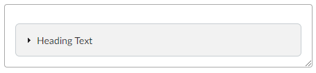
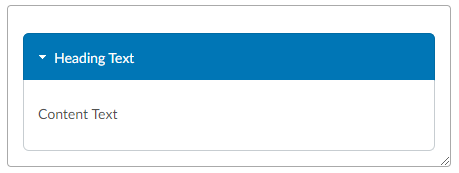

# __V-Tools Activity Templates__
# Generic
## Generic Activity
## Gerneric Content
## Home Page
## Teaching Notes
---
# Introduction
## Concept Mapping
## Interview
## Learning Contract
## Note Taking
## Practice
## Prepare
## Pretest
## Project Plan
## Quiz Writing
## Research
## Sign Up
## Study
---
# Teach One Another
## Case Study
## Field Experience
## Group Problem Solving
## Group Project
## Ice Breaker
## Insight Sharing
## Jigsaw Teaching
## Peer Accountability
## Peer Feedback
## Presentation
## Q&A Support Forum
## Role Play
## Structured Debate
## Study Group
## Teach One Another
## Topic Discussion
---
# Ponder/Prove
## Accountability Quiz
## Exam
## Exercise
## Paper/Essay
## Ponder Prove
## Portfolio
## Post-Test
## Project
## Quiz
## Reflection
## Report
## Worksheet
---
---
# __V-Tool Web Features__
## Accordion
### Description: 
Hideable dropdown textbox
### Options:
__Heading Text:__ Text that is always visble. Usually a short title to preface the content.\
__Content Text:__ Text that is hidden or shown depending on whether the accordian is expanded or collapsed.
### Guidelines:
-  
### Images
Accordian Closed\
\
Accordian Open\

## Button
### Description:
### Options:
### Guidelines:

## Callout
### Description:
### Options:
### Guidelines:

## Columns
### Description:
### Options:
### Guidelines:

## Definition
### Description:
### Options:
### Guidelines:

## Dialog
### Description:
### Options:
### Guidelines:

## Image
### Description:
### Options:
### Guidelines:

## Popover
### Description:
### Options:
### Guidelines:

## Table
### Description:
### Options:
### Guidelines:
