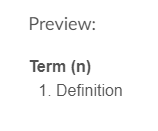

# Table of Contents
## Activity Templates
1. [Generic](#generic)
    * [Generic Activity](#generic-activity)
    * [Generic Content](#generic-content)
    * [Home Page](#home-page)
    * [Teaching Notes](#teaching-notes)
    * [Introduction](#introduction)
2. [Prepare](#prepare)
    * [Concept Mapping](#concept-mapping)
    * [Interview](#interview)
    * [Learning Contract](#learning-contract)
    * [Note Taking](#note-taking)
    * [Practice](#practice)
    * [Prepare](#prepare)
    * [Pretest](#pretest)
    * [Project Plan](#project-plan)
    * [Quiz Writing](#quiz-writing)
    * [Research](#research)
    * [Sign Up](#sign-up)
    * [Study](#study)
3. [Teach One Another](#teach-one-another)
    * [Case Study](#case-study)
    * [Field Experience](#field-experience)
    * [Group Problem Solving](#group-problem-solving)
    * [Group Project](#group-project)
    * [Ice Breaker](#ice-breaker)
    * [Insight Sharing](#insight-sharing)
    * [Jigsaw Teaching](#jigsaw-teaching)
    * [Peer Accountability](#peer-accountability)
    * [Peer Feedback](#peer-feedback)
    * [Presentation](#presentation)
    * [Q&A Support Forum](#q&a-support-forum)
    * [Role Play](#role-play)
    * [Structured Debate](#structured-debate)
    * [Study Group](#study-group)
    * [Teach One Another](#teach-one-another)
    * [Topic Discussion](#topic-discussion)
4. [Ponder/Prove](#ponder/prove)
    * [Accountability Quiz](#accountability-quiz)
    * [Exam](#exam)
    * [Exercise](#exercise)
    * [Paper/Essay](#paper/essay)
    * [Ponder Prove](#ponder-prove)
    * [Portfolio](#portfolio)
    * [Post-Test](#post-test)
    * [Project](#project)
    * [Quiz](#quiz)
    * [Reflection](#reflection)
    * [Report](#report)
    * [Worksheet](#worksheet)
## Web Features
1. [Accordion](#accordion)
2. [Button](#button)
3. [Callout](#callout)
4. [Columns](#columns)
5. [Definition](#definition)
6. [Dialog](#dialog)
7. [Image](#image)
8. [Popover](#popover)
9. [Table](#table)
---
# __V-Tools Activity Templates__
# Generic
## Generic Activity
### Description
Contains the template for a generic activity. The template includes sections for the assignment overview, instructions, and an optional custom H2 header tag. The
optional tag is intended for additional information such as notes, reminders, next
steps, etc.
### Guidelines
This is used ...
### Code
```HTML
<div class="byui ">
    <div class="overview">
        <h2>Overview</h2>
        <p>Review the description below for a quick overview of this activity.</p>
        <ul>
            <li>
                <strong>Task: </strong>[Specify actions and
                <em>emphasize main actions</em>.]</li>
            <li>
                <strong>Purpose:</strong> [Explain purpose and value of activity.]</li>
            <li>
                <strong>Instructor:</strong> [Describe relevant instructor role in activity.]</li>
        </ul>
    </div>
    <div class="instructions">
        <h2>Instructions</h2>
        <p>To successfully complete this activity, carefully follow these steps:</p>
        <ol>
            <li>[Indicate any prescribed method or steps for completing activity]</li>
            <li>[Include any unique conditions, time constraints, or submission requirements]</li>
            <li>[List any tools or resources needed]</li>
            <li>[Ensure that any grading criteria listed matches the rubric (if used)]</li>
        </ol>
    </div>
    <div class="custom">
        <h2>[Custom H2 (Optional)]</h2>
        <ul>
            <li>[Include any additional information such as notes, reminders, next steps, etc.]</li>
        </ul>
    </div>
</div>
```
## Generic Content
### Description
Contatins the template for generic content. The template only includes instructions
for the designer. The instructions are for determining if activity-specific content should be separated to a single content page or remain on the activity page. The instructions also ask the design questions about screen real estate, time to consume information, number of items on the page, scope of use, and maintainability of the page.
### Guidelines
This is used ...
### Code
```HTML
<div class="byui ">
    <div class="content">
        <p>
            <em>[For Designers: Review these factors for determining if activity-specific content should be separated to
                a single content page or remain on the activity page. Delete this text when finished.]</em>
        </p>
        <ul>
            <li>
                <em>[Screen Real Estate - Does content take up a lot of screen real estate?]</em>
            </li>
            <li>
                <em>[Time to Consume - Will content take a long time for students to consume?]</em>
            </li>
            <li>
                <em>[Number of Items - Are there a significant number of content items?]</em>
            </li>
            <li>
                <em>[Scope of Use - Will content be used in multiple activities across week/course?]</em>
            </li>
            <li>
                <em>[Maintainability - Is it anticipated that ongoing maintenance of content will be high?]</em>
            </li>
        </ul>
        <p>
            <em>[Reminder: When creating a separate content page, the page can either be included in the module view or linked
                to a Study activity page and hidden from the module view.]</em>
        </p>
        <p>[Content goes here.]</p>
    </div>
</div>
```
## Home Page
### Description
Contatins the template for the home page. The template includes a section for welcoming the students to the course. It also includes various buttons that
are intended to be used as links to specific places in the course. These links
include: Start Here, Your Instructor, Syllabus, Additional Resources, and links
to each week 1-14.
### Guidelines
This is used ...
### Code
```HTML
<div class="byui ">
    <div class="welcome">
        
        <h2>Welcome to </h2>
        <p>Lorem ipsum dolor sit amet, consectetur adipiscing elit, sed do eiusmod tempor incididunt ut labore et dolore magna aliqua. Ut enim ad minim veniam, quis nostrud exercitation ullamco laboris nisi ut aliquip ex ea commodo consequat. Duis aute irure dolor in reprehenderit in voluptate velit esse cillum dolore eu fugiat nulla pariatur. Excepteur sint occaecat cupidatat non proident, sunt in culpa qui officia deserunt mollit anim id est laborum.</p>
    </div>
    <div id="navigation">
        <div class="steps">
            <a id="start" class="Button Button--primary" href="#">Start Here</a>
            <a id="instructor" class="Button Button--primary" href="#">Your Instructor</a>
            <a id="syllabus" class="Button Button--primary" href="#">Syllabus</a>
            <a id="resources" class="Button Button--primary" href="#">Additional Resources</a>
        </div>
        <h2>Weeks</h2>
        <div class="lessons">
            <div>
                <a>1</a>
                <a>2</a>
                <a>3</a>
                <a>4</a>
                <a>5</a>
                <a>6</a>
                <a>7</a>
            </div>
            <div>
                <a>8</a>
                <a>9</a>
                <a>10</a>
                <a>11</a>
                <a>12</a>
                <a>13</a>
                <a>14</a>
            </div>
        </div>
    </div>
</div>
```
## Teaching Notes
### Description
Contatins the template for teaching notes. The template includes sections for week objectives, before the week begins, during the week, grading/feedback, and looking ahead.
### Guidelines
This is used ...
### Code
```HTML
<div class="byui ">
    <div class="objectives">
        <h2>Week Objectives</h2>
        <ul>
            <li>[Objective statement 1]</li>
            <li>[Objective statement 2]</li>
            <li>[Objective statement 3]</li>
            <li>[etc.]</li>
        </ul>
    </div>
    <div class="beforeTheWeekBegins">
        <h2>Before the Week Begins</h2>
        <ul>
            <li>Refer to the General Teaching Notes [link] or Course Map [link] as needed.</li>
            <li>Ensure your W[##] Announcement has been posted. (You may consider including a reminder that students can
                utilize the Notes from Instructor discussion board to ask questions of you or others.)</li>
            <li>[Include any other relevant information for the instructor.]</li>
        </ul>
    </div>
    <div class="duringTheWeek">
        <h2>During the Week</h2>
        <ul>
            <li>Monitor and answer any questions that may arise in the Notes from Instructor discussion board.</li>
            <li>Monitor and participate in [list any discussions taking place]. Help students focus on mastering the objectives
                for this week. Ask guiding questions to extend and deepen student learning.</li>
            <li>[Include any other relevant monitoring/participation activities for the instructor.]</li>
        </ul>
    </div>
    <div class="gradingFeedback">
        <h2>Grading/Feedback</h2>
        <ul>
            <li>[List all activities, indicate whether they are graded or auto-graded, and specify what level of feedback
                is needed.]
            </li>
        </ul>
    </div>
    <div class="lookingAhead">
        <h2>Looking Ahead</h2>
        <ul>
            <li>Please create and post your Announcement for W[##] by Friday of this week.</li>
        </ul>
    </div>
</div>
```
## Introduction
### Description
Contatins the template for the week introduction. The template includes sections for the overview, objectives, and activities. The overview section contains subsections for tasks, purposes, and instructor(optional).
### Guidelines
This is used ...
### Code
```HTML
<div class="byui ">
    <div class="overview">
        <h2>Overview</h2>
        <p>Review the description below for a quick overview of this week’s activities.</p>
        <ul>
            <li>
                <strong>Tasks: </strong>
                <em>Learn about</em> [emphasize
                <em>major</em>
                <em>topic</em>(s)], [emphasize
                <em>important</em>
                <em>activity</em> they shouldn’t overlook], and [final activity of the week].</li>
            <li>
                <strong>Purpose:</strong> [Explain overall purpose and value behind the week’s activities.]</li>
            <li>
                <strong>Instructor:</strong> [Describe instructor’s high-level role for this week.]</li>
        </ul>
    </div>
    <div class="objectives">
        <h2>Objectives</h2>
        <p>Review the objectives below to better understand the goals for this week’s activities.</p>
        <ul>
            <li>[Objective statement 1]</li>
            <li>[Objective statement 2]</li>
            <li>[Objective statement 3]</li>
            <li>[etc.]</li>
        </ul>
    </div>
    <div class="activities">
        <h2>Activities</h2>
        <p>Review the full list of activities below to understand what will be expected of you this week.</p>
        <ol>
            <li>[Activity 1 title - brief description of activity]</li>
            <li>[Activity 2 title - brief description of activity]</li>
            <li>[Activity 3 title - brief description of activity]</li>
            <li>[etc.]</li>
        </ol>
    </div>
</div>
```
---
# Prepare
## Concept Mapping
### Description
Contatins the template for concept mapping. The template includes sections for the overview, instructions, and an optional H2 header tag. The optional tag is intended for additional information such as notes, reminders, next steps, etc. 
### Guidelines
This is used ...
### Code
```HTML
<div class="byui ">
    <div class="overview">
        <h2>Overview</h2>
        <p>Review the description below for a quick overview of this activity.</p>
        <ul>
            <li>
                <strong>Task:</strong>
                <em> Create </em>a
                <em> concept map of</em> [describe and
                <em>highlight</em> topics/concepts/principles].</li>
            <li>
                <strong>Purpose:</strong> This will [explain purpose and value].</li>
            <li>
                <strong>Instructor:</strong> Your instructor will [Describe relevant instructor role in activity.]</li>
        </ul>
    </div>
    <div class="instructions">
        <h2>Instructions</h2>
        <p>To successfully complete this activity, carefully follow these steps:</p>
        <ol>
            <li>[Concept map should adhere to the prescribed method]
                <ol>
                    <li>[Ensure students understand what a concept map is and what it is not; example map be useful]</li>
                    <li>[Indicate required steps to complete—such as number of branches]</li>
                    <li>[Indicate any texts, resources, or documents needed to help complete concept map]</li>
                </ol>
            </li>
            <li>[Concept map should utilize the appropriate tool(s)]
                <ol>
                    <li>[Indicate the tool, if any, that students will use and how they will use it].</li>
                </ol>
            </li>
            <li>[Concept map should show clear understanding of topic(s)]
                <ol>
                    <li>[Indicate specific topics that should be represented].</li>
                </ol>
            </li>
            <li>[Concept map should adhere to submission requirements]
                <ol>
                    <li>[Include criteria for grading]</li>
                    <li>[Specify timeline for submission, especially if revisions are allowed, peer feedback is solicited,
                        or if there are multiple deliverables]</li>
                </ol>
            </li>
        </ol>
    </div>
    <div class="custom">
        <h2>[Custom H2 (Optional)]</h2>
        <ul>
            <li>[Include any additional information such as notes, reminders, next steps, etc.]</li>
        </ul>
    </div>
</div>
```
## Interview
### Description
Contatins the template for an interview page. The template includes sections for the overview, instructions, and an optional H2 header tag.  The optional tag is intended for additional information such as notes, reminders, next steps, etc.
### Guidelines
This is used ...
### Code
```HTML
<div class="byui ">
    <div class="overview">
        <h2>Overview</h2>
        <p>Review the description below for a quick overview of this activity.</p>
        <ul>
            <li>
                <strong>Task: </strong>
                <em>Interview</em> [describe and
                <em>highlight</em> interviewee]
                <em>about</em> [describe and
                <em>highlight</em> what information must be gained].</li>
            <li>
                <strong>Purpose:</strong> This will [explain purpose and value].</li>
            <li>
                <strong>Instructor:</strong> Your instructor will [describe relevant instructor role in activity].</li>
        </ul>
    </div>
    <div class="instructions">
        <h2>Instructions</h2>
        <p>To successfully complete this activity, carefully follow these steps:</p>
        <ol>
            <li>[Interview should adhere to the prescribed method]
                <ol>
                    <li>[Indicate whether it will be completed individually or by group]</li>
                    <li>[Indicate required steps to complete—particularly if multiple documents/deliverables are required]</li>
                    <li>[Indicate any resources, documents, or artifacts needed to help complete interview]</li>
                </ol>
            </li>
            <li>[Interview should utilize the appropriate tool(s)]
                <ol>
                    <li>[Indicate the tool, if any, that students will use and how they will use it].</li>
                </ol>
            </li>
            <li>[Interview should show clear understanding of topic(s)]
                <ol>
                    <li>[Indicate specific topics to cover and when].</li>
                </ol>
            </li>
            <li>[Interview should adhere to submission requirements]
                <ol>
                    <li>[If group interview, then include expectations of members as well as criteria for grading individuals
                        and groups]</li>
                    <li>[Specify timeline for submission, especially if revisions are allowed, peer feedback is solicited,
                        or if there are multiple deliverables]</li>
                </ol>
            </li>
        </ol>
    </div>
    <div class="custom">
        <h2>[Custom H2 (Optional)]</h2>
        <ul>
            <li>[Include any additional information such as notes, reminders, next steps, etc.]</li>
        </ul>
    </div>
</div>
```
## Learning Contract
### Description
Contatins the template for the learning contract. The template includes sections for the overview, instructions, and an optional H2 header tag.  The optional tag is intended for additional information such as notes, reminders, next steps, etc.
### Guidelines
This is used ...
### Code
```HTML
<div class="byui ">
    <div class="overview">
        <h2>Overview</h2>
        <p>Review the description below for a quick overview of this activity.</p>
        <ul>
            <li>
                <strong>Task:</strong>
                <em> Create </em>a
                <em> learning contract outlining</em> [describe and
                <em>highlight</em> what behaviors/deliverables student will be responsible for].</li>
            <li>
                <strong>Purpose:</strong> This will [explain purpose and value].</li>
            <li>
                <strong>Instructor:</strong> Your instructor will [describe relevant instructor role in activity].</li>
        </ul>
    </div>
    <div class="instructions">
        <h2>Instructions</h2>
        <p>To successfully complete this activity, carefully follow these steps:</p>
        <ol>
            <li>[Learning contract should adhere to the prescribed method]
                <ol>
                    <li>[Indicate required steps to complete—particularly if multiple documents/deliverables are required]</li>
                    <li>[Indicate any goals or plans which students must articulate upfront, and how they will be held accountable]</li>
                    <li>[Indicate any resources, documents, or artifacts needed to help complete contract]</li>
                </ol>
            </li>
            <li>[Learning contract should utilize the appropriate tool(s)]
                <ol>
                    <li>[Indicate the tool, if any, that students will use and how they will use it].</li>
                </ol>
            </li>
            <li>[Learning contract should adhere to submission requirements]
                <ol>
                    <li>[Specify timeline for submission, especially if there are multiple deliverables]</li>
                </ol>
            </li>
        </ol>
    </div>
    <div class="custom">
        <h2>[Custom H2 (Optional)]</h2>
        <ul>
            <li>[Include any additional information such as notes, reminders, next steps, etc.]</li>
        </ul>
    </div>
</div>
```
## Note Taking
### Description
Contatins the template for the note taking page. The template includes sections for the overview, instructions, and an optional H2 header tag.  The optional tag is intended for additional information such as notes, reminders, next steps, etc.  
### Guidelines
This is used ...
### Code
```HTML
<div class="byui ">
    <div class="overview">
        <h2>Overview</h2>
        <p>Review the description below for a quick overview of this activity.</p>
        <ul>
            <li>
                <strong>Task:</strong>
                <em> Study </em>and
                <em> take notes on</em> [describe and
                <em>highlight</em> what must be reviewed].</li>
            <li>
                <strong>Purpose:</strong> This will [explain purpose and value].</li>
            <li>
                <strong>Instructor:</strong> Your instructor will [describe relevant instructor role in activity].</li>
        </ul>
    </div>
    <div class="instructions">
        <h2>Instructions</h2>
        <p>To successfully complete this activity, carefully follow these steps:</p>
        <ol>
            <li>[Note taking should adhere to the prescribed method]
                <ol>
                    <li>[Indicate whether it will be completed individually or by group]</li>
                    <li>[Indicate any unique steps and/or resources needed to complete]</li>
                    <li>[Indicate any note taking strategy—e.g. Cornell Method—required]</li>
                </ol>
            </li>
            <li>[Note taking should utilize the appropriate tool(s)]
                <ol>
                    <li>[Indicate the tool, if any, that students will use and how they will use it].</li>
                </ol>
            </li>
            <li>[Note taking should adhere to submission requirements]
                <ol>
                    <li>[Indicate whether a deliverable is required for this activity]</li>
                    <li>[If group note taking, then include expectations of members as well as criteria for grading individuals
                        and groups]</li>
                </ol>
            </li>
        </ol>
    </div>
    <div class="custom">
        <h2>[Custom H2 (Optional)]</h2>
        <ul>
            <li>[Include any additional information such as notes, reminders, next steps, etc.]</li>
        </ul>
    </div>
</div>
```
## Practice
### Description
Contatins the template for the practice page. The template includes sections for the overview, instructions, and an optional H2 header tag.  The optional tag is intended for additional information such as notes, reminders, next steps, etc. 
### Guidelines
This is used ...
### Code
```HTML
<div class="byui ">
    <div class="overview">
        <h2>Overview</h2>
        <p>Review the description below for a quick overview of this activity.</p>
        <ul>
            <li>
                <strong>Task:</strong>
                <em> Practice </em>[describe and
                <em>highlight </em>what to practice].</li>
            <li>
                <strong>Purpose:</strong> This will [explain purpose and value].</li>
            <li>
                <strong>Instructor:</strong> Your instructor will [describe relevant instructor role in activity].</li>
        </ul>
    </div>
    <div class="instructions">
        <h2>Instructions</h2>
        <p>To successfully complete this activity, carefully follow these steps:</p>
        <ol>
            <li>[Practice should adhere to the prescribed method]
                <ol>
                    <li>[Indicate what skills students are practicing and the timeline expectations—particularly if
                        in preparation for a summative assignment]</li>
                    <li>[Indicate whether it will be completed individually or by group]</li>
                </ol>
            </li>
            <li>[Practice should utilize the appropriate tool(s)]
                <ol>
                    <li>[Indicate the tool, if any, that students will use and how they will use it].</li>
                </ol>
            </li>
            <li>[Practice should adhere to submission requirements]
                <ol>
                    <li>[Indicate whether a deliverable is required for this activity]</li>
                    <li>[If group work is required, then include expectations of members as well as criteria for grading
                        individuals and groups]</li>
                </ol>
            </li>
        </ol>
    </div>
    <div class="custom">
        <h2>[Custom H2 (Optional)]</h2>
        <ul>
            <li>[Include any additional information such as notes, reminders, next steps, etc.]</li>
        </ul>
    </div>
</div>
```
## Prepare
### Description
Contatins the template for the prepare page. The template includes sections for the overview, instructions, and an optional H2 header tag.  The optional tag is intended for additional information such as notes, reminders, next steps, etc. 
### Guidelines
This is used ...
### Code
```HTML
<div class="byui ">
    <div class="overview">
        <h2>Overview</h2>
        <p>Review the description below for a quick overview of this activity.</p>
        <ul>
            <li>
                <strong>Task:</strong>
                <em> Prepare for </em>[describe and
                <em>highlight </em>what to prepare for].</li>
            <li>
                <strong>Purpose:</strong> This will [explain purpose and value].</li>
            <li>
                <strong>Instructor:</strong> Your instructor will [describe relevant instructor role in activity].</li>
        </ul>
    </div>
    <div class="instructions">
        <h2>Instructions</h2>
        <p>To successfully complete this activity, carefully follow these steps:</p>
        <ol>
            <li>[Preparation should adhere to the prescribed method]
                <ol>
                    <li>[Indicate what students are preparing for and the timeline expectations]</li>
                    <li>[Indicate whether it will be completed individually or by group]</li>
                </ol>
            </li>
            <li>[Preparation should utilize the appropriate tool(s)]
                <ol>
                    <li>[Indicate the tool, if any, that students will use and how they will use it]</li>
                </ol>
            </li>
            <li>[Preparation should adhere to submission requirements]
                <ol>
                    <li>[Indicate whether a deliverable is required for this activity]</li>
                    <li>[If group work is required, then include expectations of members as well as criteria for grading
                        individuals and groups]</li>
                </ol>
            </li>
        </ol>
    </div>
    <div class="custom">
        <h2>[Custom H2 (Optional)]</h2>
        <ul>
            <li>[Include any additional information such as notes, reminders, next steps, etc.]</li>
        </ul>
    </div>
</div>
```
## Pretest
### Description
Contatins the template for the pretest page. The template includes three subtopics: Task, Purpose, and Instructor(Optional). It also has a section for conditions/readings/notes(optional). This section is intended to let students know information and rules about the pretest. 
### Guidelines
This is used ...
### Code
```HTML
<div class="byui ">
    <div class="quizOverview">
        <p>Review the description below for a quick overview of this activity.</p>
        <ul>
            <li>
                <strong>Task:</strong>
                <em> Complete </em>a
                <em> pretest on</em> [describe and
                <em>highlight</em> what must be understood].</li>
            <li>
                <strong>Purpose:</strong> This will [explain purpose and value].</li>
            <li>
                <strong>Instructor:</strong> Your instructor will [describe relevant instructor role in activity].</li>
        </ul>
        <h3>[Conditions/Readings/Notes (Optional)]</h3>
        <ul>
            <li>[Indicate whether it is open-book/note OR closed-book/note]</li>
            <li>[Explain when students will see correct answers]</li>
            <li>[Include any required link(s) to prior readings]</li>
        </ul>
    </div>
</div>
```
## Project Plan
### Description
Contatins the template for the project plan page. The template includes sections for the overview, instructions, and an optional H2 header tag.  The optional tag is intended for additional information such as notes, reminders, next steps, etc. 
### Guidelines
This is used ...
### Code
```HTML
<div class="byui ">
    <div class="overview">
        <h2>Overview</h2>
        <p>Review the description below for a quick overview of this activity.</p>
        <ul>
            <li>
                <strong>Task:</strong>
                <em> Create </em>a
                <em> project plan for</em> [identify and
                <em>highlight</em> project].</li>
            <li>
                <strong>Purpose:</strong> This will [explain purpose and value].</li>
            <li>
                <strong>Instructor:</strong> Your instructor will [describe relevant instructor role in activity].</li>
        </ul>
    </div>
    <div class="instructions">
        <h2>Instructions</h2>
        <p>To successfully complete this activity, carefully follow these steps:</p>
        <ol>
            <li>[Project Plan should adhere to the prescribed method]
                <ol>
                    <li>[Indicate required steps to complete—particularly if multiple documents/deliverables are required]</li>
                    <li>[Indicate any goals or plans which students must articulate up front, and how they will be held accountable]</li>
                    <li>[Indicate any resources, documents, or artifacts needed to complete plan]</li>
                    <li>[Indicate whether it will be completed individually or by group]</li>
                </ol>
            </li>
            <li>[Project Plan should utilize the appropriate tool(s)]
                <ol>
                    <li>[Indicate the tool, if any, that students will use and how they will use it].</li>
                </ol>
            </li>
            <li>[Project Plan should adhere to submission requirements]
                <ol>
                    <li>[Specify timeline for submission, especially if there are multiple deliverables]</li>
                    <li>[If group project, then include expectations of members as well as criteria for grading individuals
                        and groups]
                    </li>
                </ol>
            </li>
        </ol>
    </div>
    <div class="custom">
        <h2>[Custom H2 (Optional)]</h2>
        <ul>
            <li>[Include any additional information such as notes, reminders, next steps, etc.]</li>
        </ul>
    </div>
</div>
```
## Quiz Writing
### Description
Contatins the template for the quiz writing page. The template includes sections for the overview, instructions, and an optional H2 header tag.  The optional tag is intended for additional information such as notes, reminders, next steps, etc. 
### Guidelines
This is used ...
### Code
```HTML
<div class="byui ">
    <div class="overview">
        <h2>Overview</h2>
        <p>Review the description below for a quick overview of this activity.</p>
        <ul>
            <li>
                <strong>Task:</strong>
                <em> Create </em>and
                <em> submit quiz questions for</em> [describe and
                <em>highlight</em> lesson/topic quiz].</li>
            <li>
                <strong>Purpose:</strong> This will [explain purpose and value].</li>
            <li>
                <strong>Instructor:</strong> Your instructor will [describe relevant instructor role in activity].</li>
        </ul>
    </div>
    <div class="instructions">
        <h2>Instructions</h2>
        <p>To successfully complete this activity, carefully follow these steps:</p>
        <ol>
            <li>[Quiz questions should adhere to the prescribed method]
                <ol>
                    <li>[Indicate how many quiz items must be submitted and what topics they must assess]</li>
                    <li>[Indicate whether it will be completed individually or by group]</li>
                    <li>[As needed, include any high-level suggestions for writing good quiz items]</li>
                </ol>
            </li>
            <li>[Quiz questions should utilize the appropriate tool(s)]
                <ol>
                    <li>[Indicate the tool, if any, that students will use and how they will use it].</li>
                </ol>
            </li>
            <li>[Quiz questions should adhere to submission requirements]
                <ol>
                    <li>[Specify timeline for submission, especially if there are multiple deliverables]</li>
                    <li>[If group quiz, then include expectations of members as well as criteria for grading individuals
                        and groups]
                    </li>
                </ol>
            </li>
        </ol>
    </div>
    <div class="custom">
        <h2>[Custom H2 (Optional)]</h2>
        <ul>
            <li>[Include any additional information such as notes, reminders, next steps, etc.]</li>
        </ul>
    </div>
</div>
```
## Research
### Description
Contatins the template for the research page. The template includes sections for the overview, instructions, and an optional H2 header tag.  The optional tag is intended for additional information such as notes, reminders, next steps, etc. 
### Guidelines
This is used ...
### Code
```HTML
<div class="byui ">
    <div class="overview">
        <h2>Overview</h2>
        <p>Review the description below for a quick overview of this activity.</p>
        <ul>
            <li>
                <strong>Task:</strong>
                <em> Research</em> [describe and
                <em>highlight</em> what must be researched] for [indicate the audience].</li>
            <li>
                <strong>Purpose:</strong> This will [explain purpose and value].</li>
            <li>
                <strong>Instructor:</strong> Your instructor will [describe relevant instructor role in activity].</li>
        </ul>
    </div>
    <div class="instructions">
        <h2>Instructions</h2>
        <p>To successfully complete this activity, carefully follow these steps:</p>
        <ol>
            <li>[Research should adhere to the prescribed method]
                <ol>
                    <li>[Indicate required steps to complete—particularly if multiple documents/deliverables are required]</li>
                    <li>[Indicate topic(s) being researched and suggested keywords to use in search]</li>
                    <li>[Indicate any helpful or necessary resources, such as library tutorials and subject-specific databases]</li>
                    <li>[Indicate any parameters, such as number of sources and citation style]</li>
                    <li>[Indicate whether it will be completed individually or by group]</li>
                </ol>
            </li>
            <li>[Research should utilize the appropriate tool(s)]
                <ol>
                    <li>[Indicate the tool, if any, that students will use and how they will use it].</li>
                </ol>
            </li>
            <li>[Research should adhere to submission requirements]
                <ol>
                    <li>[Specify timeline for submission, especially if revisions are allowed, peer feedback is solicited,
                        or if there are multiple deliverables]</li>
                    <li>[If group research, then include expectations of members as well as criteria for grading individuals
                        and groups]</li>
                </ol>
            </li>
        </ol>
    </div>
    <div class="custom">
        <h2>[Custom H2 (Optional)]</h2>
        <ul>
            <li>[Include any additional information such as notes, reminders, next steps, etc.]</li>
        </ul>
    </div>
</div>
```
## Sign Up
### Description
Contatins the template for the sign up page. The template includes sections for the overview, instructions, and an optional H2 header tag.  The optional tag is intended for additional information such as notes, reminders, next steps, etc. 
### Guidelines
This is used ...
### Code
```HTML
<div class="byui ">
    <div class="overview">
        <h2>Overview</h2>
        <p>Review the description below for a quick overview of this activity.</p>
        <ul>
            <li>
                <strong>Task:</strong>
                <em> Sign up for</em> [describe and
                <em>highlight</em> what students will sign up for—e.g. Groups, topics, dates to present, etc.] using
                [indicate sign-up tool].</li>
            <li>
                <strong>Purpose:</strong> This will [explain purpose and value].</li>
            <li>
                <strong>Instructor:</strong> Your instructor will [describe relevant instructor role in activity].</li>
        </ul>
    </div>
    <div class="instructions">
        <h2>Instructions</h2>
        <p>To successfully complete this activity, carefully follow these steps:</p>
        <ol>
            <li>[Sign-up should adhere to the prescribed method]
                <ol>
                    <li>[Indicate any unique steps and/or resources needed to complete]</li>
                </ol>
            </li>
            <li>[Sign-up should utilize the appropriate tool(s)]
                <ol>
                    <li>[Indicate the tool, if any, that students will use and how they will use it].</li>
                </ol>
            </li>
        <li>[Sign-up should adhere to submission requirements]
            <ol>
                <li>[If graded then include any needed grading criteria]</li>
            </ol>
        </li>
    </ol>
    </div>
    <div class="custom">
        <h2>[Custom H2 (Optional)]</h2>
        <ul>
            <li>[Include any additional information such as notes, reminders, next steps, etc.]</li>
        </ul>
    </div>
</div>
```
## Study
### Description
Contatins the template for the study page. The template includes sections for the overview, instructions, and an optional H2 header tag.  The optional tag is intended for additional information such as notes, reminders, next steps, etc.
### Guidelines
This is used ...
### Code
```HTML
<div class="byui ">
    <div class="overview">
        <h2>Overview</h2>
        <p>Review the description below for a quick overview of this activity.</p>
        <ul>
            <li>
                <strong>Task:</strong>
                <em> [Study/Review] [name of material(s)]</em>
                <strong>.</strong>
            </li>
            <li>
                <strong>Purpose:</strong> This will [explain purpose and value].</li>
            <li>
                <strong>Instructor:</strong> Your instructor will [describe relevant instructor role in activity].</li>
        </ul>
    </div>
    <div class="instructions">
        <h2>Instructions</h2>
        <p>To successfully complete this activity, carefully follow these steps:</p>
        <ol>
            <li>[Process Requirements? If any, indicate]
                <ol>
                    <li>[List of things to read/watch/listen to]</li>
                </ol>
            </li>
            <li>[Tool Requirements? If any, indicate tutorials or other helpful resources]</li>
        </ol>
    </div>
    <div class="custom">
        <h2>[Custom H2 (Optional)]</h2>
        <ul>
            <li>[Include any additional information such as notes, reminders, next steps, etc.]</li>
        </ul>
    </div>
</div>
```
---
# Teach One Another
## Case Study
### Description
Contatins the template for the case study page. The template includes sections for the overview and instructions.
### Guidelines
This is used ...
### Code
```HTML
<div class="byui ">
    <div class="overview">
        <h2>Overview</h2>
        <p>Review the description below for a quick overview of this activity.</p>
        <ul>
            <li>
                <strong>Task:</strong>
                <em> With your group, analyze</em> the [describe and
                <em>highlight</em> the scenario or problem], and evaluate alternative solutions to address [indicate and
                highlight the scenario or problem].</li>
            <li>
                <strong>Purpose:</strong> This will [explain purpose and value].</li>
            <li>
                <strong>Instructor:</strong> Your instructor will [describe relevant instructor role in activity].</li>
        </ul>
    </div>
    <div class="instructions">
        <h2>Instructions</h2>
        <p>To successfully complete this activity, carefully follow these steps:</p>
        <ol>
            <li>[Team should adhere to the prescribed method]
                <ol>
                    <li>[Indicate the format of the case; e.g. Is it a simplified mini case? Multiple complex cases requiring
                        teams to make decisions with limited information?]</li>
                    <li>[Indicate any needed or helpful resources; e.g. Decision-making and consequences of professionals—after
                        students have analyzed case.]</li>
                    <li>[Indicate any metrics for determining good decision-making and reasoning]</li>
                    <li>[Indicate any requirements regarding persuasiveness, professionalism, etc.]</li>
                </ol>
            </li>
            <li>[Team should utilize the appropriate tool(s) to organize, share, and present findings]
                <ol>
                    <li>[Indicate the tool that students will use to collaborate, if any; and, how they will share their
                        solutions, with optional tutorials to utilize].</li>
                    <li>[If using a slide deck, specify if there is a required number of slides].</li>
                </ol>
            </li>
            <li>[Team should demonstrate clear understanding of topics]
                <ol>
                    <li>[Indicate any high-level topics to cover and when]</li>
                </ol>
            </li>
            <li>[Team should adhere to submission requirements]
                <ol>
                    <li>[If group presentation, then include expectations of members as well as criteria for grading individuals
                        and groups]</li>
                    <li>[Specify timeline for submission, especially if revisions are allowed and/or peer feedback is solicited]</li>
                </ol>
            </li>
        </ol>
    </div>
</div>
```
## Field Experience
### Description
Contatins the template for the field experience page. The template includes sections for the overview, instructions, and an optional H2 header tag.  The optional tag is intended for additional information such as notes, reminders, next steps, etc. 
### Guidelines
This is used ...
### Code
```HTML
<div class="byui ">
    <div class="overview">
        <h2>Overview</h2>
        <p>Review the description below for a quick overview of this activity.</p>
        <ul>
            <li>
                <strong>Task:</strong>
                <em> Conduct </em>a
                <em> field experience </em>outside of class
                <em> to</em> [indicate and
                <em>highlight</em> type of Field Experience—e.g., Interview or shadow a professional, conduct an experiment,
                teach or present to someone, etc].</li>
            <li>
                <strong>Purpose:</strong> This will [explain purpose and value].</li>
            <li>
                <strong>Instructor:</strong> Your instructor will [describe relevant instructor role in activity].</li>
        </ul>
    </div>
    <div class="instructions">
        <h2>Instructions</h2>
        <p>To successfully complete this activity, carefully follow these steps:</p>
        <ol>
            <li>[Team or Individual should adhere to the prescribed method]
                <ol>
                    <li>[Specify any unique requirements; e.g., sharing experiences with others in discussion forums or on
                        social media]
                    </li>
                    <li>[Specify what activities should be completed; e.g. take notes, analyze processes, gather work samples,
                        record videos, etc.]</li>
                </ol>
            </li>
            <li>[Team or Individual [specify] should utilize the appropriate tool(s)]
                <ol>
                    <li>[Specify tools to be used for knowledge sharing, collaborating and sharing report]</li>
                </ol>
            </li>
            <li>[Team or Individual [specify] should demonstrate clear understanding of topics]
                <ol>
                    <li>[Specify any intended topics or abilities needing to be captured in report]</li>
                </ol>
            </li>
            <li>[Team or Individual [specify] should adhere to submission requirements]
                <ol>
                    <li>[Specify format of report; e.g., written, presentation (asynchronous or synchronous), or video]</li>
                    <li>[Specify audience for report; e.g., small group, instructor, or class]</li>
                </ol>
            </li>
        </ol>
    </div>
    <div class="custom">
        <h2>[Custom H2 (Optional)]</h2>
        <ul>
            <li>[Include any additional information such as notes, reminders, next steps, etc.]</li>
        </ul>
    </div>
</div>
```
## Group Problem Solving
### Description
Contatins the template for the group problem solving page. The template includes sections for the overview, instructions, and an optional H2 header tag.  The optional tag is intended for additional information such as notes, reminders, next steps, etc. 
### Guidelines
This is used ...
### Code
```HTML
<div class="byui ">
    <div class="overview">
        <h2>Overview</h2>
        <p>Review the description below for a quick overview of this activity.</p>
        <ul>
            <li>
                <strong>Task:</strong>
                <em> Within your group, </em>work together to
                <em> discover </em>and
                <em> organize</em> [indicate and
                <em>highlight</em> concepts].</li>
            <li>
                <strong>Purpose:</strong> This will [explain purpose and value].</li>
            <li>
                <strong>Instructor:</strong> Your instructor will [describe relevant instructor role in activity].</li>
        </ul>
    </div>
    <div class="instructions">
        <h2>Instructions</h2>
        <p>To successfully complete this activity, carefully follow these steps:</p>
        <ol>
            <li>[Group should adhere to the prescribed method]
                <ol>
                    <li>[Specify if groups need to be arranged by students]</li>
                    <li>[Specify any required tasks and roles in groups]</li>
                    <li>[Specify the timeline for the activity and how often it should occur]</li>
                </ol>
            </li>
            <li>[Group should utilize the appropriate tool(s) for collaboration and knowledge sharing]
                <ol>
                    <li>[Specify tool and/or resources to be used for group collaboration and knowledge sharing</li>
                </ol>
            </li>
            <li>[Group should show clear understanding of topics]
                <ol>
                    <li>[Specify any intended topics or competencies that will be assessed]</li>
                </ol>
            </li>
            <li>[Group should adhere to submission requirements]
                <ol>
                    <li>[Specify or include a rubric defining how students are to be graded both individually and collectively]</li>
                </ol>
            </li>
        </ol>
    </div>
    <div class="custom">
        <h2>[Custom H2 (Optional)]</h2>
        <ul>
            <li>[Include any additional information such as notes, reminders, next steps, etc.]</li>
        </ul>
    </div>
</div>
```
## Group Project
### Description
Contatins the template for the group project page. The template includes sections for the overview and instructions. 
### Guidelines
This is used ...
### Code
```HTML
<div class="byui ">
    <div class="overview">
        <h2>Overview</h2>
        <p>Review the description below for a quick overview of this activity.</p>
        <ul>
            <li>
                <strong>Task:</strong>
                <em> Within your group, </em>work together to
                <em> create</em>
                <em>a</em> [indicate and
                <em>highlight</em> deliverable; e.g., paper, report, presentation, video, etc.] for [indicate the audience].</li>
            <li>
                <strong>Purpose: </strong>This will [explain purpose and value].</li>
            <li>
                <strong>Instructor:</strong> Your instructor will [describe relevant instructor role in activity].</li>
        </ul>
    </div>
    <div class="instructions">
        <h2>Instructions</h2>
        <p>To successfully complete this activity, carefully follow these steps:</p>
        <ol>
            <li>[Group should adhere to the prescribed method]
                <ol>
                    <li>[Specify the relevant topic(s) or skill(s) tied to project]</li>
                    <li>[Specify how students are grouped, if not done already]</li>
                    <li>[Specify timeline—particularly if multiple deliverables are required]</li>
                    <li>[Specify the format of the product and how students will be graded for the product and the process]</li>
                    <li>[Specify expectations for dividing up and assigning tasks among group members]</li>
                </ol>
            </li>
            <li>[Group should utilize the appropriate resources and tools]
                <ol>
                    <li>[Explain what resources are acceptable for research, if needed; e.g., scholarly, popular, expert
                        interview, etc.]
                    </li>
                    <li>[Specify what tool(s) should be used for collaborating and presenting artifact]</li>
                </ol>
            </li>
            <li>[Group should adhere to submission requirements]
                <ol>
                    <li>[Specify any formatting requirements or time/length restrictions]</li>
                    <li>[Reiterate the intended audience of the submitted project and their role]</li>
                    <li>[Specify how groups and individuals will be graded for their role in group project]</li>
                    <li>[Specify any other submission requirements]</li>
                </ol>
            </li>
        </ol>
    </div>
</div>
```
## Ice Breaker
### Description
Contatins the template for the ice breaker page. The template includes sections for the overview, instructions, and an optional H2 header tag.  The optional tag is intended for additional information such as notes, reminders, next steps, etc. 
### Guidelines
This is used ...
### Code
```HTML
<div class="byui ">
    <div class="overview">
        <h2>Overview</h2>
        <p>Review the description below for a quick overview of this activity.</p>
        <ul>
            <li>
                <strong>Task:</strong>
                <em> Introduce yourself to your peers and </em>to your
                <em> instructor</em>.</li>
            <li>
                <strong>Purpose:</strong> This will [explain purpose and value].</li>
            <li>
                <strong>Instructor:</strong> Your instructor will [describe relevant instructor role in activity].</li>
        </ul>
    </div>
    <div class="instructions">
        <h2>Instructions</h2>
        <p>To successfully complete this activity, carefully follow these steps:</p>
        <ol>
            <li>[Students should adhere to the prescribed method]
                <ol>
                    <li>[Indicate criteria; e.g. specific questions, sharing a learning plan, a researched introduction from
                        their profession, pictures of themselves, research and share takeaways about a class topic, etc.]</li>
                    <li>[Provide helpful resources, if criteria solicits details beyond personal information]</li>
                    <li>[Specify if students will share with group or class; if group, then specify any group norming expectations]</li>
                </ol>
            </li>
            <li>[Students should utilize the appropriate tool(s)]
                <ol>
                    <li>[Specify any tools needed for collaboration, if outside I-Learn]</li>
                </ol>
            </li>
            <li>[Students should show respect and courtesy to their peers]
                <ol>
                    <li>[Specify any courtesy or etiquette requirements]</li>
                    <li>[Specify expectations for peers to respond to comments, if any]</li>
                </ol>
            </li>
            <li>[Students should adhere to submission requirements]
                <ol>
                    <li>[Specify any style, length or formatting requirements]</li>
                    <li>[Specify dates, especially if there are multiple post dates]</li>
                </ol>
            </li>
        </ol>
    </div>
    <div class="custom">
        <h2>[Custom H2 (Optional)]</h2>
        <ul>
            <li>[Include any additional information such as notes, reminders, next steps, etc.]</li>
        </ul>
    </div>
</div>
```
## Insight Sharing
### Description
Contatins the template for the insight sharing. The template includes sections for the overview, instructions, and an optional H2 header tag.  The optional tag is intended for additional information such as notes, reminders, next steps, etc. 
### Guidelines
This is used ...
### Code
```HTML
<div class="byui ">
    <div class="overview">
        <h2>Overview</h2>
        <p>Review the description below for a quick overview of this activity.</p>
        <ul>
            <li>
                <strong>Task:</strong>
                <em> Share your insights on</em> [indicate and
                <em>highlight</em> what insights to share].</li>
            <li>
                <strong>Purpose:</strong> This will [explain purpose and value].</li>
            <li>
                <strong>Instructor: </strong>Your instructor will [describe relevant instructor role in activity].</li>
        </ul>
    </div>
    <div class="instructions">
        <h2>Instructions</h2>
        <p>To successfully complete this activity, carefully follow these steps:</p>
        <ol>
            <li>[Students should adhere to the prescribed method]
                <ol>
                    <li>[Specify what insights to share; e.g. spiritual thoughts, skill tips, public relations journal/blogs,
                        favorite video share, experience with subject matter, etc.]</li>
                    <li>[Specify format of activity; e.g. creating a prompt for others to respond to, discuss insights from
                        readings with an assigned moderator, etc.]</li>
                    <li>[Specify audience—class or groups; include expectations for responding to comments, if any]</li>
                </ol>
            </li>
            <li>[Students should utilize the appropriate tool(s)]
                <ol>
                    <li>[Specify any tools needed for collaboration, if outside I-Learn]</li>
                </ol>
            </li>
            <li>[Students will adhere to submission requirements]
                <ol>
                    <li>[Specify any style, length or formatting requirements]</li>
                    <li>[Specify dates, especially if there are multiple post dates]</li>
                </ol>
            </li>
        </ol>
    </div>
    <div class="custom">
        <h2>[Custom H2 (Optional)]</h2>
        <ul>
            <li>[Include any additional information such as notes, reminders, next steps, etc.]</li>
        </ul>
    </div>
</div>
```
## Jigsaw Teaching
### Description
Contatins the template for the jigsaw teaching page. The template includes sections for the overview and instructions. 
### Guidelines
This is used ...
### Code
```HTML
<div class="byui ">
    <div class="overview">
        <h2>Overview</h2>
        <p>Review the description below for a quick overview of this activity.</p>
        <ul>
            <li>
                <strong>Task: </strong>
                <em>Within your group, research</em> [indicate and
                <em>highlight</em> topic component
                <strong>]</strong> to create a clearer picture of [specify the topic].</li>
            <li>
                <strong>Purpose:</strong> This will [explain purpose and value].</li>
            <li>
                <strong>Instructor:</strong> Your instructor will [describe relevant instructor role in activity].</li>
        </ul>
    </div>
    <div class="instructions">
        <h2>Instructions</h2>
        <p>To successfully complete this activity, carefully follow these steps:</p>
        <ol>
            <li>[Group members should adhere to the prescribed method]
                <ol>
                    <li>[Specify any readings, key questions or principles, or other guidelines to direct research.]</li>
                    <li>[Specify timeline for each portion of activity]</li>
                    <li>[Indicate how groups are organized and size]</li>
                    <li>[Indicate whether topics can be chosen by groups, usually from a preset list, or are assigned from
                        a preset list]</li>
                    <li>[Indicate that group “experts” have to meet with other group “experts” in
                        the same topic to research and discuss about it]</li>
                    <li>[Specify process, readings, expectations, timeline, and deliverables for “experts” to
                        take back to their respective groups]</li>
                    <li>[Specify process, readings, expectations, timeline, and deliverables within peer groups]</li>
                </ol>
            </li>
            <li>[Group members should utilize the appropriate tool(s) for collaboration and presenting]
                <ol>
                    <li>[Indicate tools for collaboration, sharing and future presenting]</li>
                </ol>
            </li>
            <li>[Group members should demonstrate clear understanding of topic(s)]
                <ol>
                    <li>[Specify any intended topics or competencies that will be assessed]</li>
                </ol>
            </li>
            <li>[Group members should adhere to the submission requirements]
                <ol>
                    <li>[Include all grading criteria across the multiple steps as well as how individuals and/or groups
                        will be assessed]</li>
                </ol>
            </li>
        </ol>
    </div>
</div>
```
## Peer Accountability
### Description
Contatins the template for the peer accountability page. The template includes sections for the overview, instructions, and an optional H2 header tag.  The optional tag is intended for additional information such as notes, reminders, next steps, etc. 
### Guidelines
This is used ...
### Code
```HTML
<div class="byui ">
    <div class="overview">
        <h2>Overview</h2>
        <p>Review the description below for a quick overview of this activity.</p>
        <ul>
            <li>
                <strong>Task:</strong>
                <em> Work with your accountability partner on</em> [indicate and
                <em>highlight</em> topic/assignment/expectations].</li>
            <li>
                <strong>Purpose:</strong> This will [explain purpose and value].</li>
            <li>
                <strong>Instructor:</strong> Your instructor will [describe relevant instructor role in activity].</li>
        </ul>
    </div>
    <div class="instructions">
        <h2>Instructions</h2>
        <p>To successfully complete this activity, carefully follow these steps:</p>
        <ol>
            <li>[Student pairs should report to one another using the prescribed method]
                <ol>
                    <li>[Specify format and scope of reporting; e.g., learning contracts, peer reading checks, milestone
                        reports, peer tutoring, performance feedback, etc.]</li>
                    <li>[Specify time frame and/or specific assignments to include for peer accountability]</li>
                    <li>[Specify if instructor should be included in accountability checks]</li>
                    <li>[Specify if there are any summative reports or peer evaluations due to instructor]</li>
                </ol>
            </li>
            <li>[Student pairs should utilize the appropriate tool(s)]
                <ol>
                    <li>[Specify if any tools are required, especially if outside I-Learn]</li>
                </ol>
            </li>
        </ol>
    </div>
    <div class="custom">
        <h2>[Custom H2 (Optional)]</h2>
        <ul>
            <li>[Include any additional information such as notes, reminders, next steps, etc.]</li>
        </ul>
    </div>
</div>
```
## Peer Feedback
### Description
Contatins the template for the peer feedback page. The template includes sections for the overview, instructions, and an optional H2 header tag.  The optional tag is intended for additional information such as notes, reminders, next steps, etc. 
### Guidelines
This is used ...
### Code
```HTML
<div class="byui ">
    <div class="overview">
        <h2>Overview</h2>
        <p>Review the description below for a quick overview of this activity.</p>
        <ul>
            <li>
                <strong>Task:</strong>
                <em> Provide </em>and
                <em> receive feedback on</em> [indicate and
                <em>highlight</em> artifact].</li>
            <li>
                <strong>Purpose:</strong> This will [explain purpose and value].</li>
            <li>
                <strong>Instructor:</strong> Your instructor will [describe relevant instructor role in activity].</li>
        </ul>
    </div>
    <div class="instructions">
        <h2>Instructions</h2>
        <p>To successfully complete this activity, carefully follow these steps:</p>
        <ol>
            <li>[Feedback offered to peers should adhere to the prescribed method]
                <ol>
                    <li>[Include rubric specifying what meaningful feedback should address and include]</li>
                    <li>[Indicate timeline for feedback, especially if requiring multiple reviews and revisions; e.g. in
                        preparing a final product]</li>
                    <li>[Indicate peer group organization]</li>
                </ol>
            </li>
            <li>[Feedback offered to peers should utilize the appropriate tool(s)]
                <ol>
                    <li>[Indicate any tool being used, especially if outside I-Learn]</li>
                </ol>
            </li>
            <li>[Feedback offered to peers should adhere to submission requirements]
                <ol>
                    <li>[Indicate if projects are to be reviewed individually or by groups]</li>
                    <li>[Indicate if there is a requirement for reporting feedback; e.g., in a subsequent quiz or email]</li>
                </ol>
            </li>
        </ol>
    </div>
    <div class="custom">
        <h2>[Custom H2 (Optional)]</h2>
        <ul>
            <li>[Include any additional information such as notes, reminders, next steps, etc.]</li>
        </ul>
    </div>
</div>
```
## Presentation
### Description
Contatins the template for the presentation page. The template includes sections for the overview, instructions, and an optional H2 header tag.  The optional tag is intended for additional information such as notes, reminders, next steps, etc. 
### Guidelines
This is used ...
### Code
```HTML
<div class="byui ">
    <div class="overview">
        <h2>Overview</h2>
        <p>Review the description below for a quick overview of this activity.</p>
        <ul>
            <li>
                <strong>Task:</strong>
                <em> Create </em>a
                <em> presentation on</em> [describe and
                <em>highlight</em> what must be presented], for [indicate the audience] in [#] [minutes/slides] or less.</li>
            <li>
                <strong>Purpose:</strong> This will [explain purpose and value].</li>
            <li>
                <strong>Instructor:</strong> Your instructor will [describe relevant instructor role in activity].</li>
        </ul>
    </div>
    <div class="instructions">
        <h2>Instructions</h2>
        <p>To successfully complete this activity, carefully follow these steps:</p>
        <ol>
            <li>[Presentation should adhere to a prescribed method]
                <ol>
                    <li>[Indicate whether it will be completed individually or by group]</li>
                    <li>[Indicate required documents to include]</li>
                    <li>[Indicate any requirements for visuals; if so, provide resources to find free/open images]</li>
                </ol>
            </li>
            <li>[Presentation should utilize the appropriate tool(s)]
                <ol>
                    <li>[Indicate the tool that students will use and how they will present, with optional tutorials to utilize].</li>
                    <li>[If using a slide deck, specify if there is a required number of slides].</li>
                </ol>
            </li>
            <li>[Presentation should show clear understanding of topic(s)]
                <ol>
                    <li>[Indicate any high-level topics to cover].</li>
                </ol>
            </li>
            <li>[Presentation should adhere to submission requirements]
                <ol>
                    <li>[If group presentation, then include expectations of members as well as criteria for grading individuals and
                      groups]</li>
                    <li>[Specify timeline for submission, especially if revisions are allowed and/or peer feedback is solicited]</li>
                </ol>
            </li>
        </ol>
    </div>
    <div class="custom">
        <h2>[Custom H2 (Optional)]</h2>
        <ul>
            <li>[Include any additional information such as notes, reminders, next steps, etc.]</li>
        </ul>
    </div>
</div>
```
## Q&A Support Forum
### Description
Contatins the template for the Q&A support form page. The template includes sections for the overview, instructions, and an optional H2 header tag.  The optional tag is intended for additional information such as notes, reminders, next steps, etc. 
### Guidelines
This is used ...
### Code
```HTML
<div class="byui ">
    <div class="overview">
        <h2>Overview</h2>
        <p>Review the description below for a quick overview of this activity.</p>
        <ul>
        <li>
            <strong>Task:</strong>
            <em> Post any course-related questions on</em> [indicate and
            <em>highlight</em> forum type; e.g., Office Hours, Notes from Instructor, etc.]</li>
        <li>
            <strong>Purpose:</strong> This will [explain purpose and value].</li>
        <li>
            <strong>Instructor:</strong> Your instructor will [describe relevant instructor role in activity].</li>
        </ul>
    </div>
    <div class="instructions">
        <h2>Instructions</h2>
        <p>To successfully complete this activity, carefully follow these steps:</p>
        <ol>
        <li>[If posting a question, students should adhere to the prescribed method]
            <ol>
            <li>[Indicate if a specific process should be followed; e.g. forward questions to a partner first, then a group,
                then the class if still unanswered]</li>
            <li>[Consider emphasizing that, where appropriate, students should include screenshots]</li>
            <li>[If a forum is time bound, indicate the time frame]</li>
            <li>[Emphasize the timeframe in which an instructor will respond to a question; e.g. instructors won’t respond
                for 24 hrs to give students a chance to answer each other]</li>
            </ol>
        </li>
        <li>[If posting a question, students should utilize the appropriate tool(s)]
            <ol>
            <li>[Indicate the location of the forum (if using I-Learn)—emphasizing if it is course-wide, module specific,
                or activity specific]</li>
            <li>[Indicate any external tools being used for forums, if any]</li>
            </ol>
        </li>
        </ol>
    </div>
    <div class="custom">
        <h2>[Custom H2 (Optional)]</h2>
        <ul>
        <li>[Include any additional information such as notes, reminders, next steps, etc.]</li>
        </ul>
    </div>
</div>
```
## Role Play
### Description
Contatins the template for the {template name here}. The template includes sections for the overview, instructions, and an optional H2 header tag.  The optional tag is intended for additional information such as notes, reminders, next steps, etc. 
### Guidelines
This is used ...
### Code
```HTML
<div class="byui ">
    <div class="overview">
        <h2>Overview</h2>
        <p>Review the description below for a quick overview of this activity.</p>
        <ul>
            <li>
                <strong>Task:</strong>
                <em> Role play</em> [indicate and
                <em>highlight</em> role(s) to perform] so that [indicate what skill(s) or topic(s) will be applied].</li>
            <li>
                <strong>Purpose:</strong> This will [explain purpose and value].</li>
            <li>
                <strong>Instructor:</strong> Your instructor will [describe relevant instructor role in activity].</li>
        </ul>
    </div>
    <div class="instructions">
        <h2>Instructions</h2>
        <p>To successfully complete this activity, carefully follow these steps:</p>
        <ol>
            <li>[Students should adhere to the prescribed method]
                <ol>
                    <li>[Indicate to students what about their roles they need to understand]</li>
                    <li>[Indicate any resources or readings to help them research their roles]</li>
                    <li>[Indicate the format and timeframe; e.g. role-based discussion, debate, group debate, simulation, negotiations,
                        variation of a jigsaw activity, etc.]</li>
                </ol>
            </li>
            <li>[Students should utilize the appropriate tool(s)]
                <ol>
                    <li>[Indicate any tools used for discussion, especially if outside of I-Learn and synchronous]</li>
                </ol>
            </li>
            <li>[Students should demonstrate clear understanding of the topic(s)]
                <ol>
                    <li>[Specify any intended topics or competencies that will be assessed]</li>
                </ol>
            </li>
            <li>[Students must adhere to submission requirements]
                <ol>
                    <li>[Indicate any unique submission requirements]</li>
                    <li>[Indicate any other grading criteria not previously specified]</li>
                </ol>
            </li>
        </ol>
    </div>
    <div class="custom">
        <h2>[Custom H2 (Optional)]</h2>
        <ul>
            <li>[Include any additional information such as notes, reminders, next steps, etc.]</li>
        </ul>
    </div>
</div>
```
## Structured Debate
### Description
Contatins the template for the {template name here}. The template includes sections for the overview and instructions. 
### Guidelines
This is used ...
### Code
```HTML
<div class="byui ">
    <div class="overview">
        <h2>Overview</h2>
        <p>Review the description below for a quick overview of this activity.</p>
        <ul>
            <li>
                <strong>Task:</strong>
                <em> Discuss </em>and
                <em> present your position on</em> [indicate and
                <em>highlight</em> topic(s)] for [indicate the audience].</li>
            <li>
                <strong>Purpose:</strong> This will [explain purpose and value].</li>
            <li>
                <strong>Instructor:</strong> Your instructor will [describe relevant instructor role in activity].</li>
        </ul>
    </div>
    <div class="instructions">
        <h2>Instructions</h2>
        <p>To successfully complete this activity, carefully follow these steps:</p>
        <ol>
            <li>[Students should adhere to the prescribed method]
                <ol>
                    <li>[Indicate whether position is assigned or chosen]</li>
                    <li>[Indicate any preparatory readings or resources to help students become better informed]</li>
                    <li>[Specify any requirements when presenting a side of an argument]</li>
                    <li>[Specify any requirements when responding to an opposing side of an argument, including showing respect and courtesy]</li>
                    <li>[Specify style of debate; e.g., political debate over candidates, historical debate over historical topics, case
                        study debate over alternative decisions, etc.]</li>
                    <li>[Indicate size and timeline of debates; e.g., groups are pre-assigned a position in which to research and collaborate
                        in a class-wide debate, or groups are divided into two teams that collaborate in group-wide debate]</li>
                </ol>
            </li>
            <li>[Students should utilize the appropriate tool(s)]
                <ol>
                    <li>[Specify whether it is asynchronous or synchronous as well as what tools will be used]</li>
                </ol>
            </li>
            <li>[Students should adhere to submission requirements]
                <ol>
                    <li>[Indicate any other grading criteria not previously specified]</li>
                </ol>
            </li>
        </ol>
    </div>
</div>
```
## Study Group
### Description
Contatins the template for the {template name here}. The template includes sections for the overview, instructions, and an optional H2 header tag.  The optional tag is intended for additional information such as notes, reminders, next steps, etc. 
### Guidelines
This is used ...
### Code
```HTML
<div class="byui ">
    <div class="overview">
        <h2>Overview</h2>
        <p>Review the description below for a quick overview of this activity.</p>
        <ul>
            <li>
                <strong>Task:</strong>
                <em> Within your group, study </em>and
                <em> review</em> [indicate and
                <em>highlight</em> specific topic(s) to be studied].</li>
            <li>
                <strong>Purpose:</strong> This will [explain purpose and value].</li>
            <li>
                <strong>Instructor:</strong> Your instructor will [describe relevant instructor role in activity].</li>
        </ul>
    </div>
    <div class="instructions">
        <h2>Instructions</h2>
        <p>To successfully complete this activity, carefully follow these steps:</p>
        <ol>
            <li>[Study groups should adhere to the prescribed method]
                <ol>
                    <li>[Specify any assigned activities; e.g. complete group assignments, study for assessments, create topic definitions
                        document, etc.]</li>
                    <li>[Specify any upfront expectations and instructions on how the group should function and what will be the outcome
                        of the group’s efforts]</li>
                    <li>[Indicate the timeline for this activity]</li>
                </ol>
            </li>
            <li>[Study groups should utilize the appropriate tool(s)]
                <ol>
                    <li>[Provide any needed resources or tools to help facilitate group study and collaboration; if possible, provide
                        several recommendations for both asynchronous and synchronous tools]</li>
                </ol>
            </li>
            <li>[Study groups should adhere to submission requirements]
                <ol>
                    <li>[If graded, specify how individuals and/or groups will be assessed through a rubric]</li>
                </ol>
            </li>
        </ol>
    </div>
    <div class="custom">
        <h2>[Custom H2 (Optional)]</h2>
        <ul>
        <li>[Include any additional information such as notes, reminders, next steps, etc.]</li>
        </ul>
    </div>
</div>
```
## Teach One Another
### Description
Contatins the template for the {template name here}. The template includes sections for the overview, instructions, and an optional H2 header tag.  The optional tag is intended for additional information such as notes, reminders, next steps, etc. 
### Guidelines
This is used ...
### Code
```HTML
<div class="byui ">
    <div class="overview">
        <h2>Overview</h2>
        <p>Review the description below for a quick overview of this activity.</p>
        <ul>
            <li>
                <strong>Task:</strong>
                <em> Teach one another</em> [indicate and
                <em>highlight</em> topic(s)].</li>
            <li>
                <strong>Purpose:</strong> This will [explain purpose and value].</li>
            <li>
                <strong>Instructor:</strong> Your instructor will [describe relevant instructor role in activity].</li>
        </ul>
    </div>
    <div class="instructions">
        <h2>Instructions</h2>
        <p>To successfully complete this activity, carefully follow these steps:</p>
        <ol>
            <li>[Students should teach one another according to the prescribed method]
                <ol>
                    <li>[Indicate how students will teach one another]</li>
                    <li>[Indicate teaching guidelines; e.g., frequency, quantity, quality, and nature of interactions—included
                        in a rubric, if needed]</li>
                    <li>[Indicate if students need to generate a topic to post and respond to in class or groups]</li>
                </ol>
            </li>
            <li>[Student should utilize the appropriate tool(s)]
                <ol>
                    <li>[Indicate if conducted asynchronously or synchronously; specify if done through I-Learn or using an external
                        tool]
                    </li>
                </ol>
            </li>
            <li>[Student should adhere to submission requirements]
                <ol>
                    <li>[Indicate timeline for teaching one another]</li>
                    <li>[Indicate whether students need to submit anything to the instructor in addition to their teach one another efforts]
                    </li>
                </ol>
            </li>
        </ol>
    </div>
    <div class="custom">
        <h2>[Custom H2 (Optional)]</h2>
        <ul>
        <li>[Include any additional information such as notes, reminders, next steps, etc.]</li>
        </ul>
    </div>
</div>
```
## Topic Discussion
### Description
Contatins the template for the {template name here}. The template includes sections for the overview, instructions, and an optional H2 header tag.  The optional tag is intended for additional information such as notes, reminders, next steps, etc. 
### Guidelines
This is used ...
### Code
```HTML
<div class="byui ">
    <div class="overview">
        <h2>Overview</h2>
        <p>Review the description below for a quick overview of this activity.</p>
        <ul>
            <li>
                <strong>Task:</strong>
                <em> Contribute to a discussion on</em> [indicate and
                <em>highlight</em> topic(s)].</li>
            <li>
                <strong>Purpose:</strong> This will [explain purpose and value].</li>
            <li>
                <strong>Instructor:</strong> Your instructor will [describe relevant instructor role in activity].</li>
        </ul>
    </div>
    <div class="instructions">
        <h2>Instructions</h2>
        <p>To successfully complete this activity, carefully follow these steps:</p>
        <ol>
            <li>[Topic Discussion should follow the prescribed method]
                <ol>
                    <li>[Indicate who will moderate discussion]</li>
                    <li>[Indicate posting guidelines; e.g. frequency, quantity, quality, and nature of interactions—included in
                        a rubric, if needed]</li>
                    <li>[Indicate if students need to generate a topic to post and respond to in class or groups]</li>
                </ol>
            </li>
            <li>[Topic Discussion should utilize the appropriate tool(s)]
                <ol>
                    <li>[Indicate if conducted asynchronously or synchronously; specify if done through I-Learn or using an external
                        tool]
                    </li>
                </ol>
            </li>
            <li>[Topic Discussion should adhere to submission requirements]
                <ol>
                    <li>[Indicate timeline for posting and responding to posts, if both are required]</li>
                    <li>[Indicate whether students need to submit anything to the instructor in addition to their participation in the
                        discussions]</li>
                </ol>
            </li>
        </ol>
    </div>
    <div class="custom">
        <h2>[Custom H2 (Optional)]</h2>
        <ul>
            <li>[Include any additional information such as notes, reminders, next steps, etc.]</li>
        </ul>
    </div>
</div>
```
---
# Ponder/Prove
## Accountability Quiz
### Description
Contatins the template for the {template name here}. The template includes three subtopics: Task, Purpose, and Instructor(Optional). It also has a section for conditions/readings/notes(optional). This section is intended to let students know information and rules about the quiz.  
### Guidelines
This is used ...
### Code
```HTML
<div class="byui ">
    <div class="quizOverview">
        <p>Review the description below for a quick overview of this activity.</p>
        <ul>
            <li>
                <strong>Task:</strong>
                <em> Account for your efforts on</em> [describe and
                <em>highlight</em> activities].</li>
            <li>
                <strong>Purpose:</strong> This will [explain purpose and value].</li>
            <li>
                <strong>Instructor:</strong> Your instructor will [describe relevant instructor role in activity].</li>
        </ul>
        <h3>[Conditions/Readings/Notes (Optional)]</h3>
        <ul>
            <li>[Indicate whether it is open-book/note OR closed-book/note]</li>
            <li>[Explain when students will see correct answers]</li>
            <li>[Include any required link(s) to prior readings]</li>
        </ul>
    </div>
</div>
```
## Exam
### Description
Contatins the template for the {template name here}. The template includes three subtopics: Task, Purpose, and Instructor(Optional). It also has a section for conditions/readings/notes(optional). This section is intended to let students know information and rules about the exam.  
### Guidelines
This is used ...
### Code
```HTML
<div class="byui ">
    <div class="quizOverview">
        <p>Review the description below for a quick overview of this activity.</p>
        <ul>
            <li>
                <strong>Task:</strong>
                <em> Complete an exam on</em> [describe and
                <em>highlight</em> topic(s).</li>
            <li>
                <strong>Purpose:</strong> This will [explain purpose and value].</li>
            <li>
                <strong>Instructor:</strong> Your instructor will [describe relevant instructor role in activity].</li>
        </ul>
        <h3>[Conditions/Readings/Notes (Optional)]</h3>
        <ul>
            <li>[Indicate whether it is open-book/note OR closed-book/note]</li>
            <li>[Explain when students will see correct answers]</li>
            <li>[Include any required link(s) to prior readings]</li>
        </ul>
    </div>
</div>
```
## Exercise
### Description
Contatins the template for the {template name here}. The template includes sections for the overview, instructions, and an optional H2 header tag.  The optional tag is intended for additional information such as notes, reminders, next steps, etc. 
### Guidelines
This is used ...
### Code
```HTML
<div class="byui ">
    <div class="overview">
        <h2>Overview</h2>
        <p>Review the description below for a quick overview of this activity.</p>
        <ul>
            <li>
                <strong>Task:</strong>
                <em> Complete an exercise on</em> [describe and
                <em>highlight</em> topic(s) or skill(s)].</li>
            <li>
                <strong>Purpose:</strong> This will [explain purpose and value].</li>
            <li>
                <strong>Instructor:</strong> Your instructor will [describe relevant instructor role in activity].</li>
        </ul>
    </div>
    <div class="instructions">
        <h2>Instructions</h2>
        <p>To successfully complete this activity, carefully follow these steps:</p>
        <ol>
            <li>[Exercise should adhere to the prescribed method]
                <ol>
                    <li>[Indicate specific topic(s) or skill(s) are being covered]</li>
                    <li>[Indicate required steps to complete—particularly what deliverables are expected]</li>
                    <li>[Indicate any textbooks, documents, or other resources needed to help complete]</li>
                    <li>[Indicate whether it will be completed individually or by group]</li>
                </ol>
            </li>
            <li>[Exercise should utilize the appropriate tool(s)]
                <ol>
                    <li>[Indicate the tool, if any, that students will use and how they will use it].</li>
                </ol>
            </li>
            <li>[Exercise should adhere to submission requirements]
                <ol>
                    <li>[Specify timeline for submission, especially if revisions are allowed, peer feedback is solicited, or if there
                      are multiple deliverables]</li>
                    <li>[If group exercise, then include expectations of members as well as criteria for grading individuals and groups]</li>
                </ol>
            </li>
        </ol>
    </div>
    <div class="custom">
        <h2>[Custom H2 (Optional)]</h2>
        <ul>
            <li>[Include any additional information such as notes, reminders, next steps, etc.]</li>
        </ul>
    </div>
</div>
```
## Paper/Essay
### Description
Contatins the template for the {template name here}. The template includes sections for the overview, instructions, and an optional H2 header tag.  The optional tag is intended for additional information such as notes, reminders, next steps, etc. 
### Guidelines
This is used ...
### Code
```HTML
<div class="byui ">
    <div class="overview">
        <h2>Overview</h2>
        <p>Review the description below for a quick overview of this activity.</p>
        <ul>
            <li>
                <strong>Task:</strong>
                <em> Write a paper</em> that
                <em>[reviews, argues, explains, etc.]</em> [describe and
                <em>highlight</em> topic(s)] for [indicate the audience].</li>
            <li>
                <strong>Purpose:</strong> This will [explain purpose and value].</li>
            <li>
                <strong>Instructor:</strong> Your instructor will [describe relevant instructor role in activity].</li>
        </ul>
    </div>
    <div class="instructions">
        <h2>Instructions</h2>
        <p>To successfully complete this activity, carefully follow these steps:</p>
        <ol>
            <li>[Paper/Essay should adhere to the prescribed method]
                <ol>
                    <li>[Indicate required steps to complete—particularly if multiple documents/deliverables are required]</li>
                    <li>[Indicate any resources, documents, or databases needed to help complete]</li>
                    <li>[Indicate whether it will be completed individually or by group]</li>
                    <li>[Indicate any citation or style guide requirement]</li>
                </ol>
            </li>
            <li>[Paper/Essay should utilize the appropriate tool(s)]
                <ol>
                    <li>[Indicate the tool, if any, that students will use and how they will use it].</li>
                </ol>
            </li>
            <li>[Paper/Essay should show clear understanding of topic(s)]
                <ol>
                    <li>[Indicate specific topics to cover and, if needed, when].</li>
                </ol>
            </li>
            <li>[Paper/Essay should adhere to submission requirements]
                <ol>
                    <li>[Specify timeline for submission, especially if revisions are allowed, peer feedback is solicited,
                        or if there are multiple deliverables]</li>
                    <li>[If group essay, then include expectations of members as well as criteria for grading individuals
                        and groups]
                    </li>
                </ol>
            </li>
        </ol>
    </div>
    <div class="custom">
        <h2>[Custom H2 (Optional)]</h2>
        <ul>
            <li>[Include any additional information such as notes, reminders, next steps, etc.]</li>
        </ul>
    </div>
</div>
```
## Ponder Prove
### Description
Contatins the template for the {template name here}. The template includes sections for the overview, instructions, and an optional H2 header tag.  The optional tag is intended for additional information such as notes, reminders, next steps, etc. 
### Guidelines
This is used ...
### Code
```HTML
<div class="byui ">
    <div class="overview">
        <h2>Overview</h2>
        <p>Review the description below for a quick overview of this activity.</p>
        <ul>
            <li>
                <strong>Task:</strong> [
                <em>Ponder </em>or
                <em>Prove</em>] [describe and
                <em>highlight</em> topic or competency].</li>
            <li>
                <strong>Purpose:</strong> This will [explain purpose and value].</li>
            <li>
                <strong>Instructor:</strong> Your instructor will [describe relevant instructor role in activity].</li>
        </ul>
    </div>
    <div class="instructions">
        <h2>Instructions</h2>
        <p>To successfully complete this activity, carefully follow these steps:</p>
        <ol>
            <li>[Ponder/Prove should adhere to the prescribed method]
                <ol>
                    <li>[Indicate topics or competencies that students will ponder or prove]</li>
                    <li>[Indicate required steps to complete—particularly, any necessary deliverables]</li>
                    <li>[Indicate any needed or useful resources]</li>
                    <li>[Indicate whether it will be completed individually or by group]</li>
                </ol>
          </li>
          <li>[Ponder/Prove should utilize the appropriate tool(s)]
              <ol>
                  <li>[Indicate the tool, if any, that students will use and how they will use it].</li>
              </ol>
          </li>
          <li>[Ponder/Prove should adhere to submission requirements]
              <ol>
                  <li>[Specify timeline for submission, especially if revisions are allowed, peer feedback is solicited, or if there
                    are multiple deliverables]</li>
                  <li>[If group work, then include expectations of members as well as criteria for grading individuals and groups]
                  </li>
              </ol>
          </li>
        </ol>
    </div>
    <div class="custom">
        <h2>[Custom H2 (Optional)]</h2>
        <ul>
            <li>[Include any additional information such as notes, reminders, next steps, etc.]</li>
        </ul>
    </div>
</div>
```
## Portfolio
### Description
Contatins the template for the {template name here}. The template includes sections for the overview, instructions, and an optional H2 header tag.  The optional tag is intended for additional information such as notes, reminders, next steps, etc. 
### Guidelines
This is used ...
### Code
```HTML
<div class="byui ">
    <div class="overview">
        <h2>Overview</h2>
        <p>Review the description below for a quick overview of this activity.</p>
        <ul>
            <li>
                <strong>Task:</strong>
                <em> Create a portfolio of</em> [describe and
                <em>highlight</em> what must be showcased].</li>
            <li>
                <strong>Purpose:</strong> This will [explain purpose and value].</li>
            <li>
                <strong>Instructor:</strong> Your instructor will [describe relevant instructor role in activity].</li>
        </ul>
    </div>
    <div class="instructions">
        <h2>Instructions</h2>
        <p>To successfully complete this activity, carefully follow these steps:</p>
        <ol>
            <li>[Portfolio should adhere to the prescribed method]
                <ol>
                    <li>[Indicate required steps to complete—particularly, what previous artifacts should be included]</li>
                    <li>[Indicate any needed or useful resources, particularly those that may have been previously used to
                        create artifacts]
                    </li>
                    <li>[Indicate whether it will be completed individually or by group]</li>
                    <li>[Indicate any citation or style guide requirement, if any]</li>
                </ol>
            </li>
            <li>[Portfolio should utilize the appropriate tool(s)]
                <ol>
                    <li>[Indicate the tool, if any, that students will use and how they will use it]</li>
                    <li>[If using a slide deck, specify if there is a required number of slides]</li>
                </ol>
            </li>
            <li>[Portfolio should show clear understanding/competency of topic(s)/skill(s)]
                <ol>
                    <li>[Indicate specific topics/skills that should be reflected]</li>
                </ol>
            </li>
            <li>[Portfolio should adhere to submission requirements]
                <ol>
                    <li>[Specify timeline for submission, especially if revisions are allowed, peer feedback is solicited,
                        or if there are multiple deliverables]</li>
                    <li>[If group portfolio, then include expectations of members as well as criteria for grading individuals
                        and groups]</li>
                </ol>
            </li>
        </ol>
    </div>
    <div class="custom">
        <h2>[Custom H2 (Optional)]</h2>
        <ul>
            <li>[Include any additional information such as notes, reminders, next steps, etc.]</li>
        </ul>
    </div>
</div>
```
## Post-Test
### Description
Contatins the template for the {template name here}. The template includes three subtopics: Task, Purpose, and Instructor(Optional). It also has a section for conditions/readings/notes(optional). This section is intended to let students know information and rules about the post-test.  
### Guidelines
This is used ...
### Code
```HTML
<div class="byui ">
    <div class="quizOverview">
        <p>Review the description below for a quick overview of this activity.</p>
        <ul>
            <li>
                <strong>Task:</strong>
                <em> Complete a post-test on</em> [describe and
                <em>highlight</em> what must be understood].</li>
            <li>
                <strong>Purpose:</strong> This will [explain purpose and value].</li>
            <li>
                <strong>Instructor:</strong> Your instructor will [describe relevant instructor role in activity].</li>
        </ul>
        <h3>[Conditions/Readings/Notes (Optional)]</h3>
        <ul>
            <li>[Indicate whether it is open-book/note OR closed-book/note]</li>
            <li>[Explain when students will see correct answers]</li>
            <li>[Include any required link(s) to prior readings]</li>
        </ul>
    </div>
</div>
```
## Project
### Description
Contatins the template for the {template name here}. The template includes sections for the overview, instructions, and an optional H2 header tag.  The optional tag is intended for additional information such as notes, reminders, next steps, etc. 
### Guidelines
This is used ...
### Code
```HTML
<div class="byui ">
    <div class="overview">
        <h2>Overview</h2>
        <p>Review the description below for a quick overview of this activity.</p>
        <ul>
            <li>
                <strong>Task:</strong>
                <em> Complete a project on</em> [describe and
                <em>highlight</em> what must be completed] for [indicate audience].</li>
            <li>
                <strong>Purpose:</strong> This will [explain purpose and value].</li>
            <li>
                <strong>Instructor:</strong> Your instructor will [describe relevant instructor role in activity].</li>
        </ul>
    </div>
    <div class="instructions">
        <h2>Instructions</h2>
        <p>To successfully complete this activity, carefully follow these steps:</p>
        <ol>
            <li>[Project should adhere to the prescribed method]
                <ol>
                    <li>[Indicate required steps to complete—particularly if multiple documents/deliverables are required]</li>
                    <li>[Indicate any resources, documents, or artifacts needed to help complete]</li>
                    <li>[Indicate whether it will be completed individually or by group]</li>
                    <li>[Indicate any citation or style guide requirement, if any]</li>
                </ol>
            </li>
            <li>[Project should utilize the appropriate tool(s)]
                <ol>
                    <li>[Indicate the tool, if any, that students will use and how they will use it]</li>
                    <li>[If using a slide deck, specify if there is a required number of slides]</li>
                </ol>
            </li>
            <li>[Project should show clear understanding/competency of topic(s)/skill(s)]
                <ol>
                    <li>[Indicate specific topics/skills that should be reflected]</li>
                </ol>
            </li>
            <li>[Project should adhere to submission requirements]
              <ol>
                  <li>[Specify timeline for submission, especially if revisions are allowed, peer feedback is solicited, or if there
                    are multiple deliverables]</li>
                  <li>[If group project, then include expectations of members as well as criteria for grading individuals and groups]
                  </li>
              </ol>
            </li>
        </ol>
    </div>
    <div class="custom">
        <h2>[Custom H2 (Optional)]</h2>
        <ul>
            <li>[Include any additional information such as notes, reminders, next steps, etc.]</li>
        </ul>
    </div>
</div>
```
## Quiz
### Description
Contatins the template for the {template name here}. The template includes three subtopics: Task, Purpose, and Instructor(Optional). It also has a section for conditions/readings/notes(optional). This section is intended to let students know information and rules about the quiz.  
### Guidelines
This is used ...
### Code
```HTML
<div class="byui ">
    <div class="quizOverview">
        <p>Review the description below for a quick overview of this activity.</p>
        <ul>
            <li>
                <strong>Task:</strong>
                <em> Complete a quiz on</em> [describe and
                <em>highlight</em> topic(s) to be assessed].</li>
            <li>
                <strong>Purpose:</strong> This will [explain purpose and value].</li>
            <li>
                <strong>Instructor:</strong> Your instructor will [describe relevant instructor role in activity].</li>
        </ul>
        <h3>[Conditions/Readings/Notes (Optional)]</h3>
        <ul>
            <li>[Indicate whether it is open-book/note OR closed-book/note]</li>
            <li>[Explain when students will see correct answers]</li>
            <li>[Include any required link(s) to prior readings]</li>
        </ul>
    </div>
</div>
```
## Reflection
### Description
Contatins the template for the {template name here}. The template includes sections for the overview, instructions, and an optional H2 header tag.  The optional tag is intended for additional information such as notes, reminders, next steps, etc. 
### Guidelines
This is used ...
### Code
```HTML
<div class="byui ">
    <div class="overview">
        <h2>Overview</h2>
        <p>Review the description below for a quick overview of this activity.</p>
        <ul>
            <li>
                <strong>Task:</strong>
                <em> Write a reflection on</em> [describe and
                <em>highlight</em> what to reflect on] for [indicate the audience].</li>
            <li>
                <strong>Purpose:</strong> This will [explain purpose and value].</li>
            <li>
                <strong>Instructor:</strong> Your instructor will [describe relevant instructor role in activity].</li>
        </ul>
    </div>
    <div class="instructions">
        <h2>Instructions</h2>
        <p>To successfully complete this activity, carefully follow these steps:</p>
        <ol>
            <li>[Reflection should adhere to the prescribed method]
                <ol>
                <li>[Indicate required steps to complete—particularly if multiple documents/deliverables are required]</li>
                <li>[Indicate any resources, documents, or artifacts needed to help complete]</li>
                <li>[Indicate whether it will be completed individually or by group]</li>
                </ol>
            </li>
            <li>[Reflection should utilize the appropriate tool(s)]
                <ol>
                <li>[Indicate the tool, if any, that students will use and how they will use it].</li>
                </ol>
            </li>
            <li>[Reflection should show thoughtful reflection of topic(s)]
                <ol>
                <li>[Indicate any previous topics, activities, or behaviors that should be reflected].</li>
                </ol>
            </li>
            <li>[Reflection should adhere to submission requirements]
                <ol>
                <li>[Specify timeline for submission, especially if revisions are allowed, peer feedback is solicited, or if there
                    are multiple deliverables]</li>
                <li>[Indicate page or word limits]</li>
                </ol>
            </li>
        </ol>
    </div>
    <div class="custom">
        <h2>[Custom H2 (Optional)]</h2>
        <ul>
            <li>[Include any additional information such as notes, reminders, next steps, etc.]</li>
        </ul>
    </div>
</div>
```
## Report
### Description
Contatins the template for the {template name here}. The template includes sections for the overview, instructions, and an optional H2 header tag.  The optional tag is intended for additional information such as notes, reminders, next steps, etc. 
### Guidelines
This is used ...
### Code
```HTML
<div class="byui ">
    <div class="overview">
        <h2>Overview</h2>
        <p>Review the description below for a quick overview of this activity.</p>
        <ul>
            <li>
                <strong>Task:</strong>
                <em> Submit a report on</em> [describe and
                <em>highlight</em> what to report on] for [indicate the audience].</li>
            <li>
                <strong>Purpose:</strong> This will [explain purpose and value].</li>
            <li>
                <strong>Instructor:</strong> Your instructor will [describe relevant instructor role in activity].</li>
        </ul>
    </div>
    <div class="instructions">
        <h2>Instructions</h2>
        <p>To successfully complete this activity, carefully follow these steps:</p>
        <ol>
            <li>[Report should adhere to the prescribed method]
                <ol>
                <li>[Indicate any previous topics, activities, or major projects that should be report on].</li>
                <li>[Indicate required steps to complete—particularly if multiple documents/deliverables are required]</li>
                <li>[Indicate any resources, documents, or artifacts needed to help complete]</li>
                <li>[Indicate whether it will be completed individually or by group]</li>
                </ol>
            </li>
            <li>[Report should utilize the appropriate tool(s)]
                <ol>
                <li>[Indicate the tool, if any, that students will use and how they will use it].</li>
                </ol>
            </li>
            <li>[Report should adhere to submission requirements]
                <ol>
                <li>[Specify timeline for submission, especially if revisions are allowed, peer feedback is solicited, or if there
                    are multiple deliverables]</li>
                <li>Indicate format of report, size or time limit restrictions, and intended audience]</li>
                </ol>
            </li>
        </ol>
    </div>
    <div class="custom">
        <h2>[Custom H2 (Optional)]</h2>
        <ul>
            <li>[Include any additional information such as notes, reminders, next steps, etc.]</li>
        </ul>
    </div>
</div>
```
## Worksheet
### Description
Contatins the template for the {template name here}. The template includes sections for the overview, instructions, and an optional H2 header tag.  The optional tag is intended for additional information such as notes, reminders, next steps, etc. 
### Guidelines
This is used ...
### Code
```HTML
<div class="byui ">
    <div class="overview">
        <h2>Overview</h2>
        <p>Review the description below for a quick overview of this activity.</p>
        <ul>
            <li>
                <strong>Task:</strong>
                <em> Complete a worksheet on</em> [describe and
                <em>highlight</em> topic(s)].</li>
            <li>
                <strong>Purpose:</strong> This will [explain purpose and value].</li>
            <li>
                <strong>Instructor:</strong> Your instructor will [describe relevant instructor role in activity].</li>
        </ul>
    </div>
    <div class="instructions">
        <h2>Instructions</h2>
        <p>To successfully complete this activity, carefully follow these steps:</p>
        <ol>
            <li>[Worksheet should adhere to the prescribed method]
                <ol>
                    <li>[Indicate required steps to complete—particularly if multiple documents/deliverables are required]</li>
                    <li>[Indicate any resources, documents, or databases needed to help complete]</li>
                    <li>[Indicate whether it will be completed individually or by group]</li>
                </ol>
            </li>
            <li>[Worksheet should utilize the appropriate tool(s)]
                <ol>
                    <li>[Indicate the tool, if any, that students will use and how they will use it].</li>
                </ol>
            </li>
            <li>[Worksheet should show clear understanding of topic(s)]
                <ol>
                    <li>[Indicate specific topics to cover and, if needed, when].</li>
                </ol>
            </li>
            <li>[Worksheet should adhere to submission requirements]
                <ol>
                    <li>[Specify timeline for submission, especially if revisions are allowed, peer feedback is solicited, or if there
                        are multiple deliverables]</li>
                    <li>[If group worksheet/workbook, then include expectations of members as well as criteria for grading individuals
                        and groups]</li>
                </ol>
            </li>
        </ol>
    </div>
    <div class="custom">
        <h2>[Custom H2 (Optional)]</h2>
        <ul>
            <li>[Include any additional information such as notes, reminders, next steps, etc.]</li>
        </ul>
    </div>
</div>
```
---
---
# __V-Tool Web Features__
## Accordion
### Description 
A web accordion is a hideable dropdown textbox. When clicked the textbox will either expand or contract.
### Options
__Heading Text__: Text that is always visible. Usually a short title to preface the content.\
__Content Text__: Text that is hidden or shown depending on whether the accordian is expanded or collapsed.
### Guidelines
This is used ...
### Images
Accordian Closed\
\
Accordian Open\


## Button
### Description
A button is a clickable object on the screen that starts an event. (Currently Not Working)
### Options
__Button Text__: Text that goes inside the button.\
__Button HTML__: N/A\
__Primary__: Checkbox that applies the primary blue color to the button.
### Guidelines
This is used ...
### Images
Default Button\
\
Primary Button with Text\


## Callout
### Description
A textbox that is inserted into a paragraph to highlight a specific piece of information. (Currently Not Working)
### Options
* __Position__: Changes the position of the callout box.
    * Left
    * Center
    * Right
* __Width__: Changes the width of the callout box.
    * Full
    * Half
    * Quarter
* __Color__: Changes the color of the callout box.
    * Simple
    * Grey
    * Green
    * Blue
    * Orange
* __Header Text__: Changes the header text of the callout box to what the user provides.
* __Content Text__: Changes the text inside the body of the callout box to what the user provides.
### Guidelines
This is used ...
### Images


## Columns
### Description
Allows the user to add one, two, or three columns.
### Options
__Number of Columns__: A radio button to select the number of columns.
### Guidelines
This is used ...
### Images


## Definition
### Description
Allows the user to define terms on the page.
### Guidelines
This is used ...
### Images


## Dialog
### Description
Allows the user to insert text into a dialog box. (Currently Not Working)
### Options
__Dialog Title__: the title of the dialog.
__Prompt Text__: The text that goes inside the dialog box.
__Content__: The title for the dialog box. This could be the same as the dialog title.
### Guidelines
This is used ...
### Images


## Image
### Description
Allows the user to insert an image onto the page with a caption.
### Options
* __Position__: Changes the position of the image.
    * Left
    * Center
    * Right
* __Width__: Changes the width of the image.
    * Full
    * Half
    * Quarter
* __ClearFix__:
* __Source URL__: The source for the image. Should be a link to where the image is on the internet.
* __Alt Text__: If the picture fails to load, this is the text that will display in its place.
* __Caption Text__: The text that goes immediately underneath the picture. This caption should give context to the picture.
### Guidelines
This is used ...
### Images


## Popover
### Description
Creates a line of text that, when hovered over by the mouse, will create a popover with text inside of it.
### Options
__Text__: The text that requires the user to hover over it.
__Popover Text__: The text that appears when the user is hovering over the line text.
### Guidelines
This is used ...
### Images
Popover without Mouse Hover\
\
Popover with Mouse Hover\


## Table
### Description
Allows the user to generate an HTML table.
### Options
__Striped__: Changes the table's rows so that every other one is a shade darker. This creates a striped effect.
### Guidelines
This is used ...
### Images
Table\
\
Table with Stripes\

